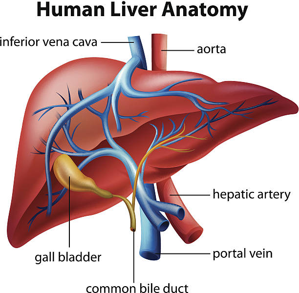

# Introduction

Liver transplantation is a life-saving therapy for patients with end-stage liver disease, and Alcohol-Associated Liver Disease (ALD) has become one of its leading indications in the United States. As ALD-related morbidity and mortality continue to rise, understanding patterns in transplant access, candidate characteristics, and post-transplant outcomes has become increasingly important.

Our project uses data from the SRTR database that collects data from transplant programs, including the United Network for Organ Sharing (UNOS). It includes a national registry that captures detailed information on all transplant candidates, recipients, and donors in the U.S. The dataset includes demographic variables, clinical severity measures, transplant events, and outcomes, allowing for comprehensive evaluation of the transplant landscape. SRTR make all data available to the public while honoring patient privacy. The data dictionary with all available variables can be found [here](https://www.srtr.org/requesting-srtr-data/saf-data-dictionary/).

In this website, we provide an overview of key aspects of liver transplantation with a focus on ALD, highlighting trends in candidate demographics, transplant rates, and post-transplant outcomes. Our goal is to offer an accessible, data-driven perspective on the evolving role of ALD in liver transplantation.

# Group Members
The contributors to this project are Elina Stoffel (es3866), Devon Park (dap2189),
Olivia Martinez (om2372), and Diane Benites (dmb2257).

# Screencast
text here
insert screen cast

## Recipent Patient Outcomes by the Type of Donor
This page explores the relationship between the type of donor and the recipient patient outcomes. The recipient patient outcomes are based on data obtained at the first follow-up after the transplant. This page includes the frequencies living and deceased liver donors and illustrates the distribution of recipient patient outcomes. Click here to learn more: [Donor Types](page1.html).

=======

## Waitlist Characteristics and Mortality
This page summarizes demographic and clinical characteristics of adults listed for liver transplantation with alcohol-related liver disease, comparing acute alcohol-related hepatitis and alcohol-related cirrhosis. It presents sex-stratified descriptive statistics, highlights differences in age, MELD score, and racial/ethnic distribution, and reports waitlist mortality and follow-up times. The page also includes Kaplan–Meier curves illustrating waitlist survival patterns across subgroups. Click here to learn more: [Waitlist](page2.html).

=======

## Donor and Recipient Characteristics
This page explores the complex needs and demographic realities of liver transplantation in the United States. On this page we explore the race and age distribution of both donors (living and deceased) and recipients and how well race and age are matched between recipients and donors. As transplantation is the only cure for end-stage liver failure, by exploring donor and recipient characteristics side-by-side, we can better understand where disparities persist and identify opportunities to improve fairness in the transplant system. Click here to learn more: [Demographics](Demographics.html).

=======

## Page 4 Title
Brief description of [Olivia's Rmd](page4.html).

